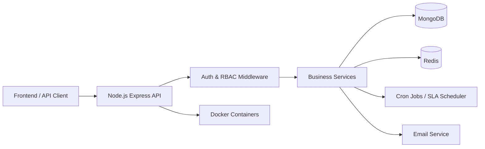

# 📌 CRM Backend System


A full-featured **CRM backend system** built using **Node.js, Express, and MongoDB**, designed to manage customer support workflows, ticket lifecycles, SLA tracking, and role-based operations in a scalable production-ready architecture.

---

# 🚀 Key Features

## 🔐 Authentication & Authorization

* JWT-based authentication (**Access & Refresh Tokens**)
* Secure login & logout
* Role-based access control:

  * 🟣 Super Admin
  * 🔵 Admin
  * 🟢 Engineer
  * 🟠 Customer
* Session security & token validation
* Two-Factor Authentication (2FA)

---

## 🎫 Ticket Management System

* Create, assign, and update tickets
* Complete lifecycle management:

```
OPEN → IN_PROGRESS → RESOLVED → CLOSED
```

* SLA tracking with automatic overdue detection
* Ticket comments & attachments
* Activity logs & audit trail
* Customer feedback & ratings
* Advanced search & filtering

---

## 📊 Dashboards & Analytics

### 👨‍💼 Admin Dashboard

* User statistics
* Ticket analytics
* Engineer workload distribution
* SLA breach monitoring

### 👨‍🔧 Engineer Dashboard

* Assigned tickets overview
* Status distribution
* Resolution analytics

### 👤 Customer Dashboard

* Created tickets
* Ticket history
* Priority & status breakdown

---

## 📦 Additional Features

* 📑 Export-ready system (Excel / PDF)
* 📧 Email notifications (Nodemailer)
* 🔔 In-app notifications
* ⏱ Automated SLA checker using cron jobs
* 📘 Swagger API documentation
* 🧪 Automated tests (Jest)
* 🐳 Docker & Docker Compose deployment
* ⚡ Redis caching support
* ❤️ Health monitoring endpoints

---

# 🛠 Tech Stack

<div align="center">


</div>

---

# 🏗 Architecture Diagram



---

# ⚙️ Installation

```bash
git clone https://github.com/YadavAnuj90/crm-backend.git
cd crm-backend
npm install
npm run dev
```

---

# 🐳 Docker Setup

```bash
docker compose up -d --build
```

---

# 📘 API Documentation

Swagger docs available at:

```
http://localhost:5000/api-docs
```

---

# 📈 Production-Ready Capabilities

* Role-based security
* Dockerized deployment
* CI/CD compatible
* Scalable database design
* Fault-tolerant background jobs
* Performance-optimized APIs

---

# 👨‍💻 Author

**Anuj Kumar**

Backend Developer | Node.js | NestJS | System Integration

---

⭐ If you find this project useful, consider giving it a star!
